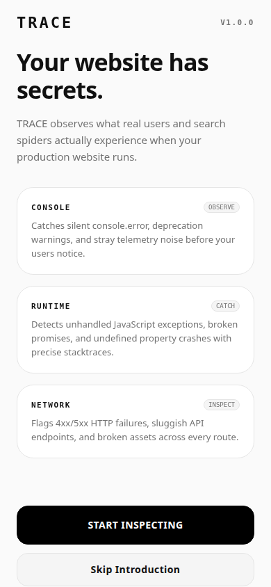
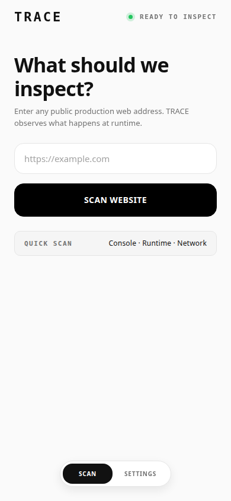
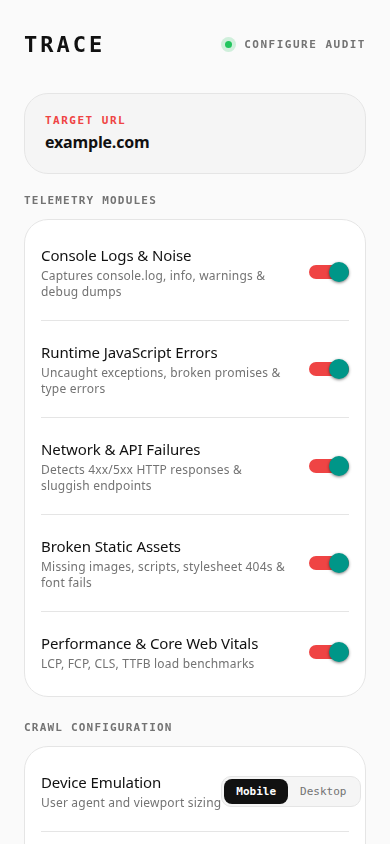
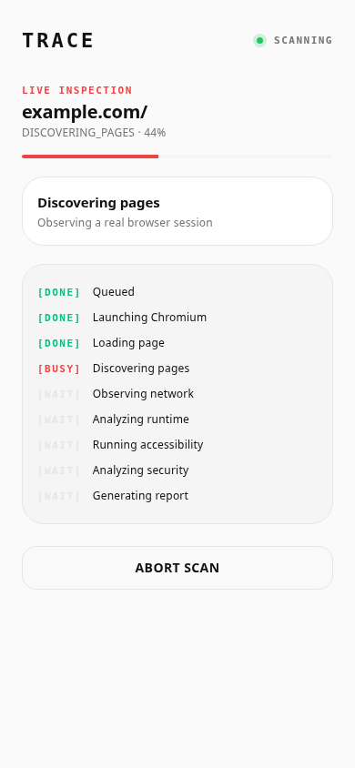
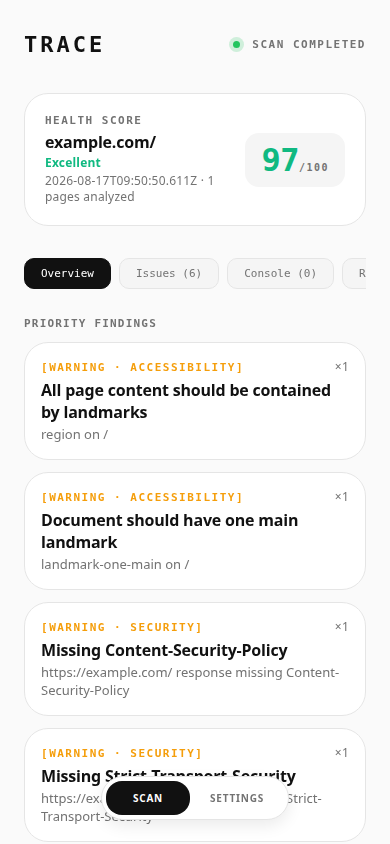
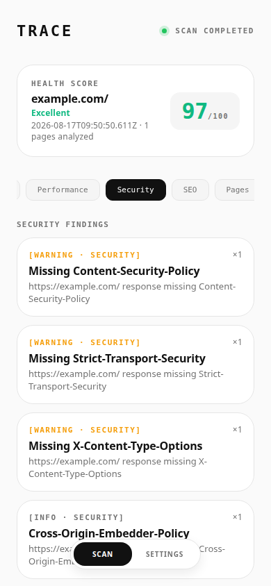
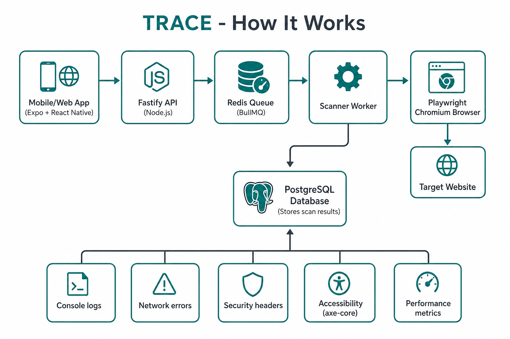

# TRACE — Interview Walkthrough

Simple guide for demoing TRACE in an interview: what to say, what to show, and how the tech works.

## One-line pitch

> **TRACE is a website health inspector.** You give it a URL, it opens a **real Chrome browser**, watches what actually happens (errors, network, security, speed, accessibility), and gives you a **score + report**.

It is **not** a hacking tool. It **observes** — it does not attack or submit forms.

---

## Demo flow (2–3 minutes)

### Step 1 — Open README (30 sec)

Open `README.md` and scroll to:

1. **Top paragraph** — what TRACE does
2. **Architecture diagram** — how pieces connect
3. **API table** — what the backend exposes

**Say:** “TRACE launches real Chromium, loads the site, records console/network/runtime/security/accessibility, stores results in Postgres, and shows them in a mobile/web app.”

### Step 2 — Show the app (1 min)

| Step | Screen | What happens |
|------|--------|--------------|
| 1 | Onboarding | Explains Console, Runtime, Network |
| 2 | Home | User enters URL |
| 3 | Configure | Toggle modules (console, network, perf, etc.) |
| 4 | Progress | Live steps: queue → browser → scan → report |
| 5 | Report | Health score + findings by category |

**Live demo:** https://trace-inspector.expo.app

### Step 3 — Explain backend (1 min)

```
User taps "Scan"
    ↓
Mobile/Web App (Expo)
    ↓
API Server (Fastify / Node.js)
    ↓
Job Queue (Redis + BullMQ)
    ↓
Worker picks up job
    ↓
Playwright opens Chromium → visits website
    ↓
Collects: console, JS errors, network, security headers, accessibility, performance
    ↓
Saves to PostgreSQL
    ↓
App polls status → shows report
```

---

## Screenshots

### Onboarding — what TRACE checks



### Home — enter URL



### Configure — choose what to inspect



### Progress — live scan steps



### Report — health score + findings



### Security tab



### Architecture



---

## Tech stack

| Layer | Tech | Role |
|-------|------|------|
| Frontend | Expo + React Native | Mobile + web UI |
| API | Fastify (Node.js) | Receives scan requests, serves results |
| Queue | Redis + BullMQ | Handles scans asynchronously |
| Scanner | Playwright + Chromium | Opens real browser, watches the site |
| Database | PostgreSQL | Stores scan results |
| Accessibility | axe-core | Finds a11y issues |
| Scoring | `server/src/scoring/health.ts` | Weighted score across categories |

---

## What happens when user clicks Scan

1. App sends `POST /api/scans` with URL + options
2. API validates URL (blocks private IPs — SSRF protection)
3. Job goes into Redis queue → returns `{ scanId, status: "queued" }`
4. Worker picks up the job
5. Playwright launches Chromium, loads the page
6. Scanner collects console, network, security, performance, accessibility data
7. Findings pipeline deduplicates and scores everything
8. Results saved to Postgres
9. App polls `GET /api/scans/:id/status` until done
10. App fetches results → shows report

---

## Strong talking points

**Security**

- Blocks scanning internal/private IPs (SSRF protection)
- Redacts passwords, tokens, auth headers
- Safe HTTP methods only (GET/HEAD/OPTIONS)
- Rate limits prevent abuse

**Scoring**

- Weighted average: Runtime, Network, Console, Performance, Accessibility, Security, SEO, Assets
- Never fakes data — reports `NOT TESTED` when something cannot run

**Production**

- API: https://trace-api-15uf.onrender.com
- Web demo: https://trace-inspector.expo.app

---

## 30-second closing line

> “TRACE is like a **doctor’s checkup for websites** — it opens the site in a real browser, listens to everything that happens, and gives you a clear health report with a score and actionable fixes. The stack is Expo frontend, Fastify API, Redis queue, Playwright scanner, and PostgreSQL storage.”
